# EShop
New Tech- Android m-commerce application for browsing and buying electronics

## 🚀 Key Features

- **User Authentication**: Secure sign-in and sign-up using **Firebase Authentication**.
- **Product Discovery**: Browse products with dynamic category filtering and smooth UI.
- **Interactive UI**: Image sliders using **Dots Indicator** and **ViewPager2**.
- **Shopping Cart**: Real-time management of items with live price updates.
- **Secure Payments**: Fully integrated with the **PayHere Android SDK**.
- **Location Services**: Integrated **Google Maps** and **Location Services** for address management.
- **Cloud Backend**: Uses **Cloud Firestore** for data and **Firebase Storage** for media assets.
- **Modern Performance**: Fast image loading with **Glide** and **Picasso**, and a custom **Splash Screen**.

## 🛠️ Tech Stack

- **Language**: Java
- **Networking**: Retrofit 3.0.0 & OkHttp 5.3.2 (with Logging Interceptor)
- **Image Handling**: Glide 5.0.5 & Picasso 2.71
- **Backend**: Firebase (Auth, Firestore, Storage, Analytics, BOM 34.11.0)
- **UI Components**: Google Material Design (1.13.0), Dots Indicator, Splash Screen API
- **Maps**: Google Play Services (Maps 20.0.0 & Location 21.3.0)
- **Utilities**: Lombok (for boilerplate reduction), GSON (JSON parsing)

## ⚙️ Setup & Installation

1. Clone the repository: https://github.com/yourusername/New-Tech.git
2. Firebase Configuration:
- Create a project in the Firebase Console.
- Add an Android app with the package name lk.jiat.eshop.
- Download the google-services.json file and place it in the app/ directory.
3. Google Maps API Key:
- This project uses the secrets-gradle-plugin.
- Create a file named local.properties in your project root folder (if not present).
- Replace the `GOOGLE_API_KEY` placeholder with your actual API key:
     
4. **Build Project**:
    - Open the project in Android Studio (Ladybug or newer).
    - Sync Gradle and run the application on a device or emulator.

📂 Project Highlights
- Architecture: Organized into activity, adapter, and fragment packages for scalability.
- Version Control: Uses Gradle Version Catalogs (libs.versions.toml) for clean dependency management.
- Security: Sensitive keys are managed via the Secrets Gradle Plugin.

📂 Screenshots

### 👤 User Panel
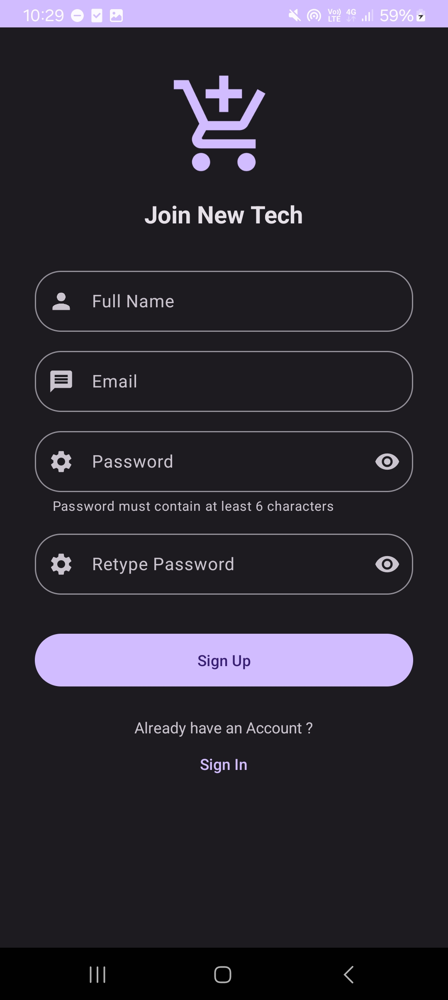
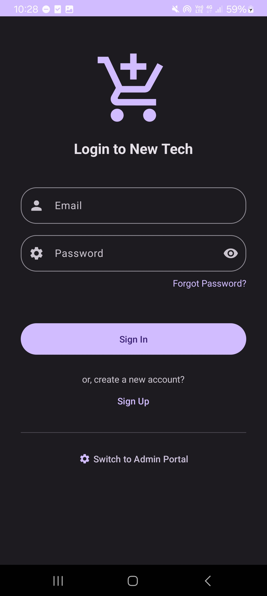
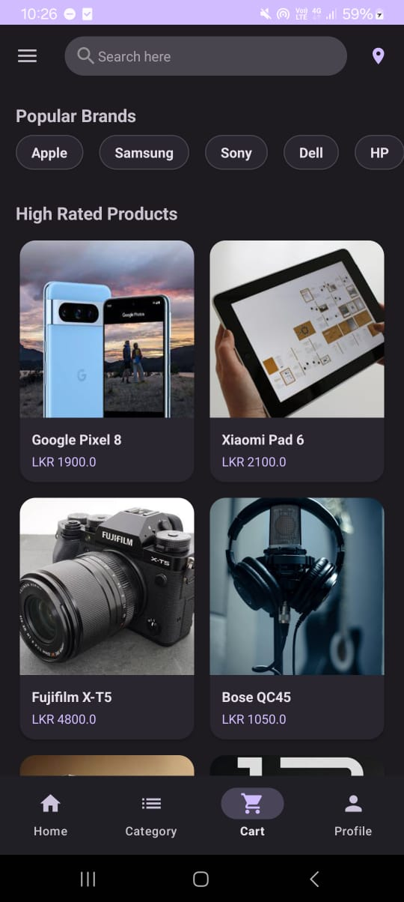
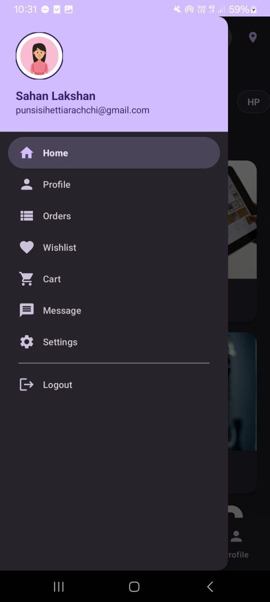
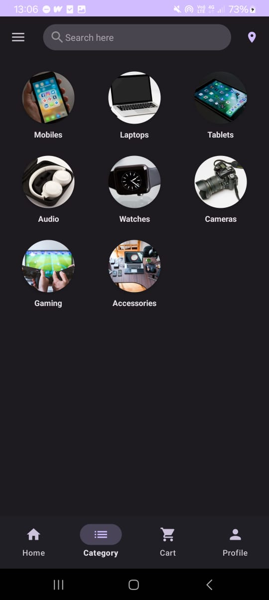
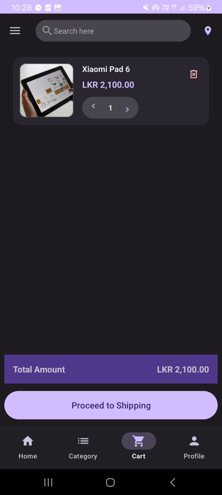
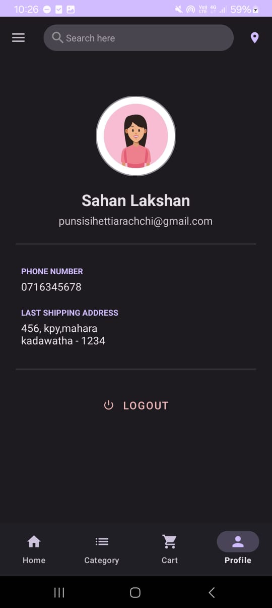

### 🛠️ Admin Panel
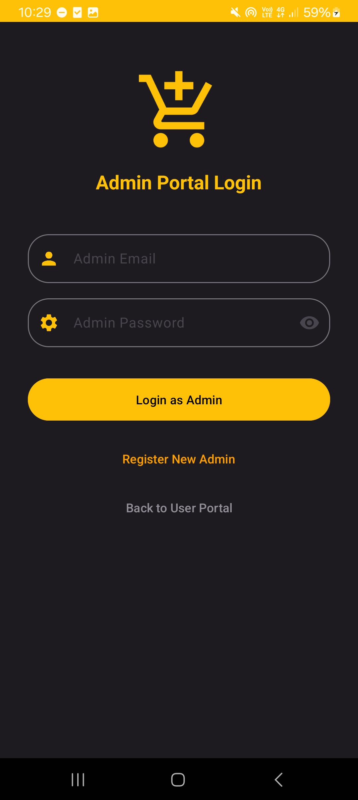
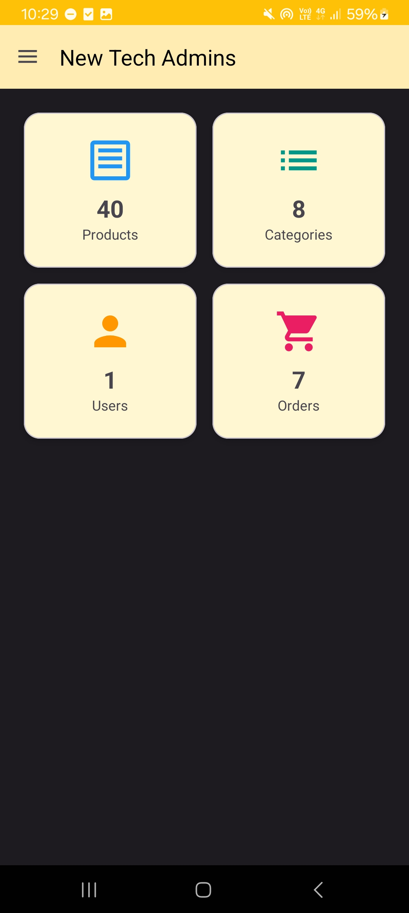
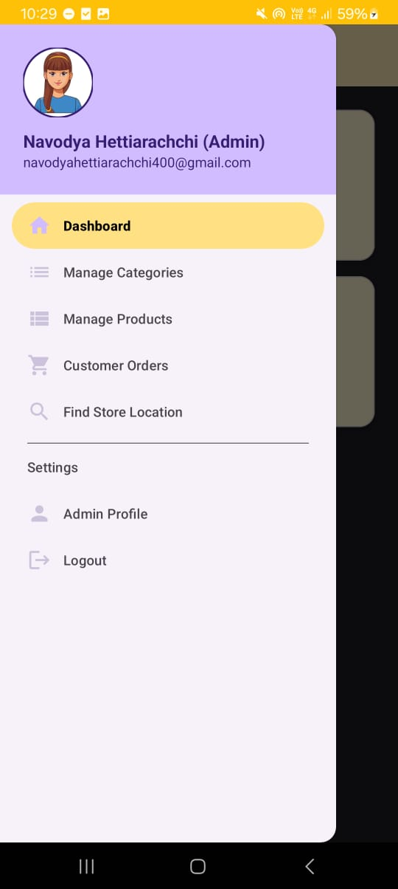
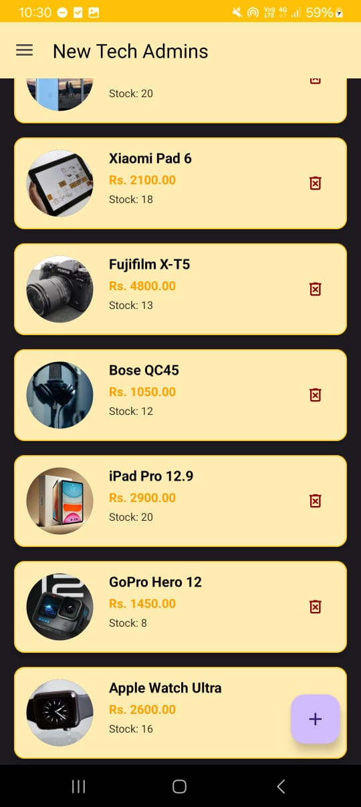
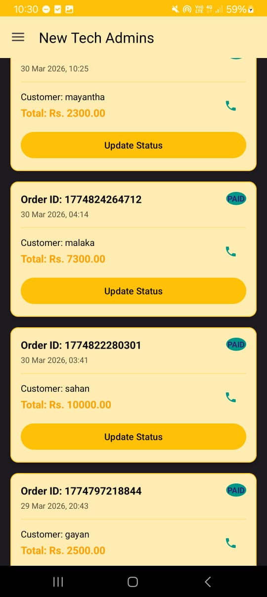

---

**📝 License**  

This project is open-source for **educational purposes only**.  
You are free to use it to **learn, explore, or improve your skills**, but **commercial use, distribution, or selling is not allowed** without permission from the original author.

---
